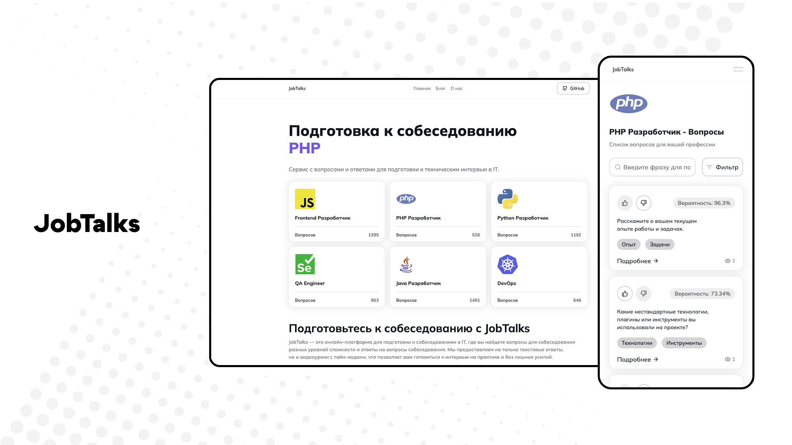

**JobTalks** — это онлайн-платформа для подготовки к собеседованиям в IT. На нашей платформе вы найдете вопросы для собеседования разных уровней сложности, а также ответы на них. Мы предоставляем не только текстовые ответы, но и видеоуроки с тайм-кодами, что позволяет готовиться к интервью на практике и без лишних усилий.

## Технологии

Этот проект использует следующий стек технологий:

- **Laravel**
- **React** 
- **Inertia.js v2** 

## Скриншот


## Установка

1. Клонируйте репозиторий:
   ```bash
   git clone https://github.com/your-username/JobTalks.git
   cd JobTalks

2. Запустите проект с помощью Docker Compose:
   ```bash
   docker-compose up --build
   
3. Запустите клиентскую часть:
   ```bash
   npm run dev
